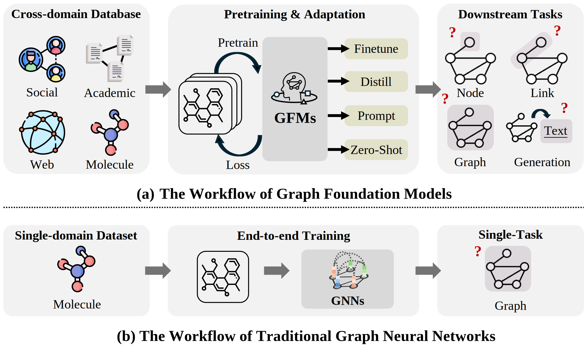
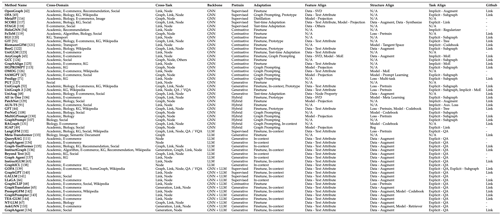
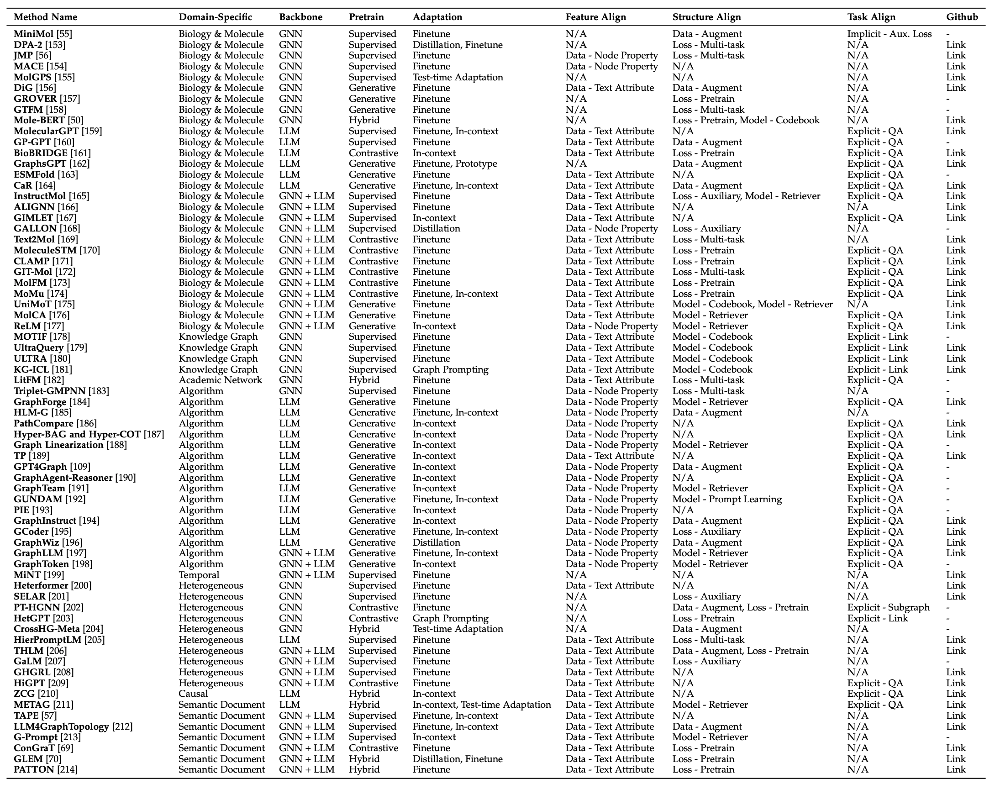
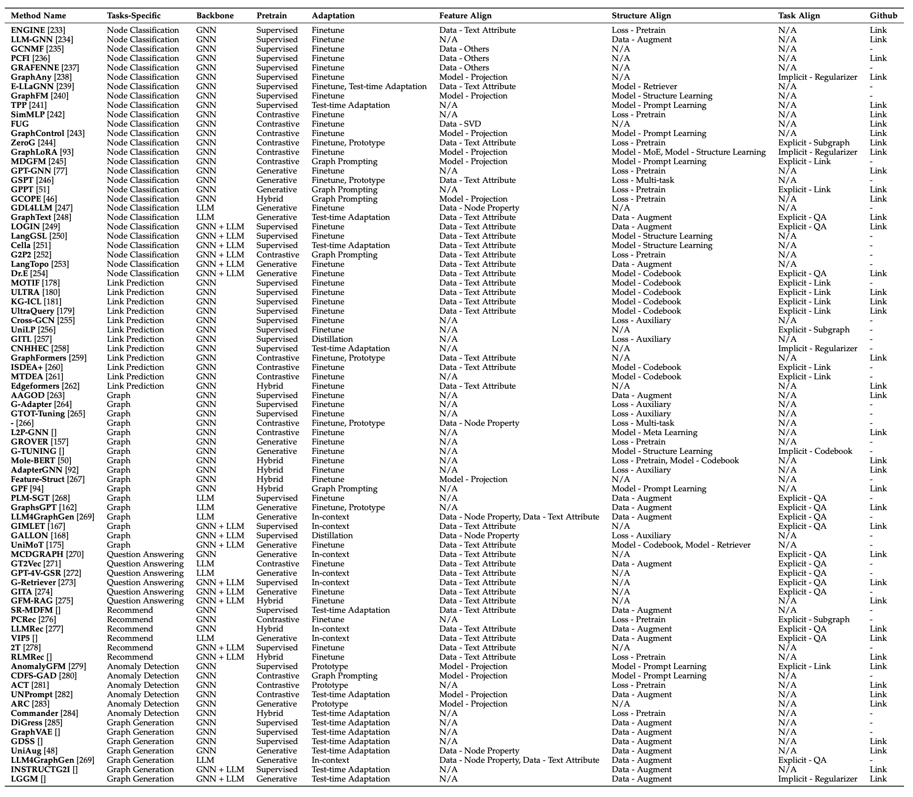

# Awesome-Foundation-Models-on-Graphs 

**The is the repo for paper: [Graph Foundation Models: A Comprehensive Survey](https://arxiv.org/abs/2505.15116)** 

**This repo will be continuously updated. Don't forget to star  it and keep tuned!** 

**Please cite the paper in [Citation](#citation) if you find the resource helpful for your research. Thanks!**

## Graph Foundation Models

  

**From Task-Specific Graph Models to General-Purpose Graph Foundation Models.** (a) GFMs are pretrained on large-scale graph corpora spanning multiple domains (e.g., social, web, academic, molecular) to acquire broadly transferable representations. Through various adaptation techniques—such as fine-tuning, distillation, prompting, or zero-shot inference—they can generalize across a wide spectrum of downstream tasks, including node classification, link prediction, graph classification, and graph-to-text generation. (b) In contrast, traditional GNNs are typically trained in an end-to-end manner on a single-domain dataset for a specific task, often lacking the scalability and generalization capabilities required for open-world settings. This shift mirrors the transition observed in language and vision domains, where foundation models have redefined the standard for general-purpose intelligence.

## Table of Contents
- [Awesome-Foundation-Models-on-Graphs ](#awesome-foundation-models-on-graphs-)
  - [Graph Foundation Models](#graph-foundation-models)
  - [Table of Contents](#table-of-contents)
  - [Benchmarks and Surveys](#benchmarks-and-surveys)
    - [Benchmarks](#benchmarks)
    - [Surveys](#surveys)
  - [Universal GFMs](#universal-gfms)
    - [Graph Model-based Methods](#graph-model-based-methods)
    - [Language Model-based Methods](#language-model-based-methods)
    - [Graph-Language Co-Training](#graph-language-co-training)
  - [Domain-Specific GFMs](#domain-specific-gfms)
    - [Biology and Molecule](#biology-and-molecule)
    - [Knowledge Graph](#knowledge-graph)
    - [Academic Graph](#academic-graph)
    - [Graph Math Reasoning](#graph-math-reasoning)
    - [Temporal Graph](#temporal-graph)
    - [Heterogeneous Graph](#heterogeneous-graph)
    - [Causal Graph](#causal-graph)
    - [Document Graph](#document-graph)
  - [Task-Specific GFMs](#task-specific-gfms)
    - [Node Classification](#node-classification)
    - [Link Prediction](#link-prediction)
    - [Graph Classification](#graph-classification)
    - [Graph Generation](#graph-generation)
    - [Question Answering](#question-answering)
    - [Recommendation](#recommendation)
    - [Anomaly Detection](#anomaly-detection)
  - [Citation](#citation)

## Benchmarks and Surveys

### Benchmarks

- [ICLR 25] **How Do Large Language Models Understand Graph Patterns? A Benchmark for Graph Pattern Comprehension** [[PDF](https://arxiv.org/abs/2410.05298)]  
- [Arxiv 25.02] **A Comprehensive Analysis on LLM-based Node Classification Algorithms** [[PDF](https://arxiv.org/abs/2502.00829)]  
- [Arxiv 24.12] **Benchmarking and Improving Large Vision-Language Models for Fundamental Visual Graph Understanding and Reasoning** [[PDF](https://arxiv.org/abs/2412.13540)] [[Code](https://github.com/AAAndy-Zhu/VGCure)]
- [EMNLP 24] **Can LLM Graph Reasoning Generalize beyond Pattern Memorization?** [[PDF](https://arxiv.org/abs/2406.15992)]  
- [KDD 24] **LLM4DyG: Can Large Language Models Solve Spatial-Temporal Problems on Dynamic Graphs?** [[PDF](https://arxiv.org/abs/2310.17110)] [[Code](https://github.com/wondergo2017/LLM4DyG)]  
- [Others 24] **TreeTop: Topology-Aware Fine-Tuning for LLM Conversation Tree Understanding** [[PDF](https://openreview.net/forum?id=RDInbUc10o)]  
- [Others 24] **FlowGPT: How Long can LLMs Trace Back and Predict the Trends of Graph Dynamics?** [[PDF](https://southnlp.github.io/southnlp2024/papers/southnlp2024-poster-22.pdf)] [[Code](https://zenodo.org/records/10517068)]  
- [Arxiv 24.10] **Are Large-Language Models Graph Algorithmic Reasoners?** [[PDF](https://arxiv.org/abs/2410.22597)] [[Code](https://github.com/ataylor24/MAGMA)]  
- [Arxiv 24.07] **GraphArena: Evaluating and Exploring Large Language Models on Graph Computation** [[PDF](https://arxiv.org/abs/2407.00379)] [[Code](https://github.com/squareRoot3/GraphArena)]  
- [Arxiv 24.06] **GraphFM: A Comprehensive Benchmark for Graph Foundation Model** [[PDF](https://arxiv.org/abs/2406.08310)]  
-  [NeurIPS 23] **Can Language Models Solve Graph Problems in Natural Language?** [[PDF](https://arxiv.org/abs/2305.10037)]  
-  [Arxiv 23.10] **Towards Foundational Models for Molecular Learning on Large-Scale Multi-Task Datasets** [[PDF](https://arxiv.org/abs/2310.04292)]  

### Surveys

- [Arxiv 25.03] **A Survey of Cross-domain Graph Learning: Progress and Future Directions** [[PDF](https://www.arxiv.org/abs/2503.11086)]
- [Arxiv 25.03] **Towards Graph Foundation Models: A Transferability Perspective** [[PDF](https://arxiv.org/abs/2503.09363)]
- [Arxiv 25.02] **Graph Foundation Models for Recommendation: A Comprehensive Survey** [[PDF](https://arxiv.org/abs/2502.08346)]
- [Arxiv 25.01] **Graph2text or Graph2token: A Perspective of Large Language Models for Graph Learning** [[PDF](https://arxiv.org/abs/2501.01124)]
- [ICML 24] **Future Directions in the Theory of Graph Machine Learning** [[PDF](https://arxiv.org/abs/2402.02287)]
- [ICML 24] **Graph Foundation Models are Already Here!** [[PDF](https://arxiv.org/abs/2402.02216)]
- [Arxiv 24.03] **A Survey on Self-Supervised Graph Foundation Models: Knowledge-Based Perspective** [[PDF](https://arxiv.org/abs/2403.16137)]
- [Arxiv 23.11] **Graph Prompt Learning: A Comprehensive Survey and Beyond** [[PDF](https://arxiv.org/abs/2311.16534)]
- [Arxiv 23.11] **A survey of graph meets large language model: Progress and future directions** [[PDF](https://arxiv.org/abs/2311.12399)]
-  [Arxiv 23.08] **Graph Meets LLMs: Towards Large Graph Models** [[PDF](https://arxiv.org/abs/2308.14522)]

## Universal GFMs

### Graph Model-based Methods

- [ICLR 25] **Holographic Node Representations: Pre-training Task-Agnostic Node Embeddings** [[PDF](https://openreview.net/forum?id=tGYFikNONB)]
- [WWW 25] **RiemannGFM: Learning a Graph Foundation Model from Riemannian Geometry** [[PDF](https://arxiv.org/abs/2502.03251)] [[Code](https://github.com/RiemannGraph/RiemannGFM)]
- [WSDM 25] **UniGLM: Training One Unified Language Model for Text-Attributed Graph Embedding** [[PDF](https://arxiv.org/abs/2406.12052)]
- [WWW 25] **SAMGPT: Text-free Graph Foundation Model for Multi-domain Pre-training and Cross-domain Adaptation** [[PDF](https://arxiv.org/abs/2502.05424)]
- [KDD 25] **UniGraph: Learning a Unified Cross-Domain Foundation Model for Text-Attributed Graphs** [[PDF](https://arxiv.org/abs/2402.13630)] [[Code](https://github.com/yf-he/UniGraph)]
- [WWW 25] **UniGraph2: Learning a Unified Embedding Space to Bind Multimodal Graphs** [[PDF](https://arxiv.org/abs/2502.00806)] [[Code](https://github.com/yf-he/UniGraph2)]
- [KDD 25] **Handling Feature Heterogeneity with Learnable Graph Patches** [[PDF](http://yangy.org/works/gnn/KDD25_GraphPatches.pdf)] [[Code](https://github.com/zjunet/PatchNet)]
- [KDD 25] **Non-Homophilic Graph Pre-Training and Prompt Learning** [[PDF](https://arxiv.org/abs/2408.12594)]
- [Arxiv 25.02] **Boosting Graph Foundation Model from Structural Perspective** [[PDF](https://arxiv.org/abs/2407.19941)] [[Code](https://anonymous.4open.science/r/BooG-EE42/README.md)]
-  [EMNLP 24] **OpenGraph: Towards Open Graph Foundation Models** [[PDF](https://arxiv.org/abs/2403.01121)] [[Code](https://github.com/HKUDS/OpenGraph)]
-  [ICLR 24] **One for All: Towards Training One Graph Model for All Classification Tasks** [[PDF](https://arxiv.org/abs/2310.00149)] [[Code](https://github.com/LechengKong/OneForAll)]
-  [NeurIPS 24] **Zero-Shot Generalization of GNNs over Distinct Attribute Domains** [[PDF](https://openreview.net/pdf?id=5btqauRdz0)]
-  [NeurIPS 24] **GFT: Graph Foundation Model with Transferable Tree Vocabulary** [[PDF](https://arxiv.org/abs/2411.06070)] [[Code](https://github.com/Zehong-Wang/GFT)]
-  [NeurIPS 24] **RAGraph: A General Retrieval-Augmented Graph Learning Framework** [[PDF](https://arxiv.org/abs/2410.23855)] [[Code](https://github.com/Artessay/RAGraph/)]
-  [WWW 24] **MultiGPrompt for Multi-Task Pre-Training and Prompting on Graphs** [[PDF](https://dl.acm.org/doi/abs/10.1145/3589334.3645423)] [[Code](https://github.com/Nashchou/MultiGPrompt)]
-  [WWW 24] **Inductive Graph Alignment Prompt: Bridging the Gap between Graph Pre-training and Inductive Fine-tuning From Spectral Perspective** [[PDF](https://arxiv.org/abs/2402.13556)]
-  [AAAI 24] **HGPROMPT: Bridging Homogeneous and Heterogeneous Graphs for Few-shot Prompt Learning** [[PDF](https://arxiv.org/abs/2312.01878)] [[Code](https://github.com/Starlien95/HGPrompt)]
-  [Arxiv 24.12] **One Model for One Graph: A New Perspective for Pretraining with Cross-domain Graphs** [[PDF](https://arxiv.org/abs/2412.00315)]
-  [Arxiv 24.12] **Towards Graph Foundation Models: Learning Generalities Across Graphs via Task-Trees** [[PDF](https://arxiv.org/abs/2412.16441)] [[Code](https://github.com/Zehong-Wang/GIT)]
-  [Arxiv 24.10] **Towards Graph Foundation Models: The Perspective of Zero-shot Reasoning on Knowledge Graphs** [[PDF](https://arxiv.org/abs/2410.12609)]
-  [Arxiv 24.08] **AnyGraph: Graph Foundation Model in the Wild** [[PDF](https://arxiv.org/abs/2408.10700)] [[Code](https://github.com/HKUDS/AnyGraph)]
-  [Arxiv 24.07] **Generalizing Graph Transformers Across Diverse Graphs and Tasks via Pre-Training on Industrial-Scale Data** [[PDF](https://arxiv.org/abs/2407.03953)]
-  [Arxiv 24.06] **GraphAlign: Pretraining One Graph Neural Network on Multiple Graphs via Feature Alignment** [[PDF](https://arxiv.org/abs/2406.02953)] [[Code](https://github.com/THUDM/GraphAlign)]
-  [Arxiv 24.06] **Cross-Domain Graph Data Scaling: A Showcase with Diffusion Models** [[PDF](https://arxiv.org/abs/2406.01899)] [[Code](https://github.com/WenzhuoTang/UniAug)]
-  [CVPR 23] **Deep Graph Reprogramming** [[PDF](https://arxiv.org/abs/2304.14593)]
-  [NeurIPS 23] **PRODIGY: Enabling In-context Learning Over Graphs** [[PDF](https://arxiv.org/abs/2305.12600)] [[Code](https://github.com/snap-stanford/prodigy)]
-  [KDD 23] **All in One: Multi-Task Prompting for Graph Neural Networks** [[PDF](https://arxiv.org/abs/2307.01504)] [[Code](https://github.com/sheldonresearch/ProG)]
-  [Others 23] **It's All Graph To Me: Single-Model Graph Representation Learning on Multiple Domains** [[PDF](https://openreview.net/forum?id=i8JgQVS30K)] [[Code](https://pypi.org/project/fotom/)]
-  [WWW 23] **GraphPrompt: Unifying Pre-Training and Downstream Tasks for Graph Neural Networks** [[PDF](https://arxiv.org/abs/2302.08043)] [[Code](https://github.com/Starlien95/GraphPrompt)]
-  [NeurIPS 21] **Transfer Learning of Graph Neural Networks with Ego-graph Information Maximization** [[PDF](https://arxiv.org/abs/2009.05204)] [[Code](https://github.com/GentleZhu/EGI)]
-  [KDD 21] **Adaptive Transfer Learning on Graph Neural Networks** [[PDF](https://arxiv.org/abs/2107.08765)] [[Code](https://github.com/Sean-Huang65/AUX-TS)]
-  [KDD 20] **GCC: Graph Contrastive Coding for Graph Neural Network Pre-Training** [[PDF](https://arxiv.org/abs/2006.09963)] [[Code](https://github.com/THUDM/GCC)]

### Language Model-based Methods

- [Arxiv 25.02] **Are Large Language Models In-Context Graph Learners?** [[PDF](https://arxiv.org/abs/2502.13562)]  
- [Arxiv 25.01] **GraphICL: Unlocking Graph Learning Potential in LLMs through Structured Prompt Design** [[PDF](https://arxiv.org/abs/2501.15755)]  
- [ACL 24] **InstructGraph: Boosting Large Language Models via Graph-centric Instruction Tuning and Preference Alignment** [[PDF](https://arxiv.org/abs/2402.08785)] [[Code](https://github.com/wjn1996/InstructGraph)]  
- [EACL 24] **Language is All a Graph Needs** [[PDF](https://arxiv.org/abs/2308.07134)] [[Code](https://github.com/agiresearch/InstructGLM)]  
- [Others 24] **GraphAgent: Exploiting Large Language Models for Interpretable Learning on Text-attributed Graphs** [[PDF](https://openreview.net/forum?id=L3jATpVEGv)]  
- [Arxiv 24.10] **LangGFM: A Large Language Model Alone Can be a Powerful Graph Foundation Model** [[PDF](https://arxiv.org/abs/2410.14961)]  
- [Arxiv 23.10] **GraphAgent: Explicit Reasoning Agent for Graphs** [[PDF](https://arxiv.org/abs/2310.16421)]  
- [Arxiv 23.10] **Beyond Text: A Deep Dive into Large Language Models' Ability on Understanding Graph Data** [[PDF](https://arxiv.org/abs/2310.04944)]  
- [Arxiv 23.07] **Meta-Transformer: A Unified Framework for Multimodal Learning** [[PDF](https://arxiv.org/abs/2307.10802)] [[Code](https://github.com/invictus717/MetaTransformer)]  
-  [Arxiv 23.04] **Graph-ToolFormer: To Empower LLMs with Graph Reasoning Ability via Prompt Augmented by ChatGPT** [[PDF](https://arxiv.org/abs/2304.11116)] [[Code](https://github.com/jwzhanggy/Graph_Toolformer)]  

### Graph-Language Co-Training

- [Arxiv 25.03] **LLM as GNN: Learning Graph Vocabulary for Foundational Graph Models** [[PDF](https://arxiv.org/abs/2503.03313)] [[Code](https://github.com/agiresearch/PromptGFM)]  
- [ICLR 25] **GOFA: A Generative One-For-All Model for Joint Graph Language Modeling** [[PDF](https://openreview.net/forum?id=mIjblC9hfm)] [[Code](https://github.com/JiaruiFeng/GOFA)]  
- [ICML 24] **LLaGA: Large Language and Graph Assistant** [[PDF](https://arxiv.org/abs/2402.08170)] [[Code](https://github.com/VITA-Group/LLaGA)]  
- [SIGIR 24] **GraphGPT: Graph Instruction Tuning for Large Language Models** [[PDF](https://arxiv.org/abs/2310.13023)] [[Code](https://github.com/HKUDS/GraphGPT)]  
- [WWW 24] **GraphTranslator: Aligning Graph Model to Large Language Model for Open-ended Tasks** [[PDF](https://arxiv.org/abs/2402.07197)] [[Code](https://github.com/alibaba/GraphTranslator)]  
- [WWW 24] **Can we Soft Prompt LLMs for Graph Learning Tasks?** [[PDF](https://dl.acm.org/doi/abs/10.1145/3589335.3651476)] [[Code](https://github.com/franciscoliu/graphprompter)]  
- [Arxiv 24.12] **GraphAgent: Agentic Graph Language Assistant** [[PDF](https://arxiv.org/abs/2412.17029)] [[Code](https://github.com/HKUDS/GraphAgent)]  
- [Arxiv 24.10] **Enhance Graph Alignment for Large Language Models** [[PDF](https://arxiv.org/abs/2410.11370)]  
- [Arxiv 24.10] **GraphCLIP: Enhancing Transferability in Graph Foundation Models for Text-Attributed Graphs** [[PDF](https://arxiv.org/abs/2410.10329)] [[Code](https://github.com/ZhuYun97/GraphCLIP)]  
-  [Arxiv 24.10] **NT-LLM: A Novel Node Tokenizer for Integrating Graph Structure into Large Language Models** [[PDF](https://arxiv.org/pdf/2410.10743)]  
-  [Arxiv 24.08] **LLMs as Zero-shot Graph Learners: Alignment of GNN Representations with LLM Token Embeddings** [[PDF](https://arxiv.org/abs/2408.14512)] [[Code](https://github.com/W-rudder/TEA-GLM)]  
-  [EMNLP 24] **Let's Ask GNN: Empowering Large Language Model for Graph In-Context Learning** [[PDF](https://aclanthology.org/2024.findings-emnlp.75/)]  

## Domain-Specific GFMs

### Biology and Molecule

- [Digital Discovery 25] **Hybrid-LLM-GNN: integrating large language models and graph neural networks for enhanced materials property prediction** [[PDF](https://pubs.rsc.org/en/content/articlehtml/2024/dd/d4dd00199k)] [[Code](https://github.com/Jonathanlyj/ALIGNN-BERT-TL-crystal)]
- [Arxiv 24.06] **MolecularGPT: Open Large Language Model (LLM) for Few-Shot Molecular Property Prediction** [[PDF](https://arxiv.org/abs/2406.12950)] [[Code](https://github.com/NYUSHCS/MolecularGPT)]
- [Arxiv 24.06] **LLM and GNN are Complementary: Distilling LLM for Multimodal Graph Learning** [[PDF](https://arxiv.org/abs/2406.01032)]
- [Arxiv 24.04] **MiniMol: A Parameter-Efficient Foundation Model for Molecular Learning** [[PDF](https://arxiv.org/abs/2404.14986)]
- [Arxiv 24.02] **A Graph is Worth K Words: Euclideanizing Graph using Pure Transformer** [[PDF](https://arxiv.org/abs/2402.02464)] [[Code](https://github.com/A4Bio/GraphsGPT)]
- [Arxiv 24.01] **A foundation model for atomistic materials chemistry** [[PDF](https://arxiv.org/abs/2401.00096)] [[Code](https://github.com/ACEsuit/mace/)]
- [Arxiv 23.12] **DPA-2: a large atomic model as a multi-task learner** [[PDF](https://arxiv.org/abs/2312.15492)] [[Code](https://zenodo.org/records/10428497)]
- [NeurIPS 24] **On the Scalability of GNNs for Molecular Graphs** [[PDF](https://openreview.net/forum?id=klqhrq7fvB&noteId=4Yy3RGUYaP)] [[Code](https://github.com/datamol-io/graphium)]
- [NMI 24] **Towards Predicting Equilibrium Distributions for Molecular Systems with Deep Learning** [[PDF](https://www.nature.com/articles/s42256-024-00837-3)] [[Code](https://distributionalgraphormer.github.io/)]
-  [ChemRxiv 24] **Graph Transformer Foundation Model for modeling ADMET properties** [[PDF](https://chemrxiv.org/engage/chemrxiv/article-details/66ebc757cec5d6c142886d28)]
-  [ICLR 24] **From Molecules to Materials: Pre-training Large Generalizable Models for Atomic Property Prediction** [[PDF](https://arxiv.org/abs/2310.16802)] [[Code](https://nima.sh/jmp/)]
-  [ICLR 24] **BioBridge: Bridging Biomedical Foundation Models via Knowledge Graphs** [[PDF](https://arxiv.org/abs/2310.03320)] [[Code](https://github.com/RyanWangZf/BioBridge)]
-  [Others 24] **GraphAgent: Exploiting Large Language Models for Interpretable Learning on Text-attributed Graphs** [[PDF](https://openreview.net/forum?id=L3jATpVEGv)]
-  [Arxiv 23.11] **InstructMol: Multi-Modal Integration for Building a Versatile and Reliable Molecular Assistant in Drug Discovery** [[PDF](https://arxiv.org/abs/2311.16208)] [[Code](https://github.com/IDEA-XL/InstructMol)]
-  [EMNLP 23] **ReLM: Leveraging Language Models for Enhanced Chemical Reaction Prediction** [[PDF](https://arxiv.org/abs/2310.13590)] [[Code](https://github.com/syr-cn/ReLM)]
-  [Arxiv 23.08] **GIT-Mol: A Multi-modal Large Language Model for Molecular Science with Graph, Image, and Text** [[PDF](https://arxiv.org/abs/2308.06911)] [[Code](https://github.com/AI-HPC-Research-Team/GIT-Mol)]
-  [Arxiv 23.07] **MolFM: A Multimodal Molecular Foundation Model** [[PDF](https://arxiv.org/abs/2307.09484)] [[Code](https://github.com/PharMolix/OpenBioMed)]
-  [Arxiv 23.07] **Can Large Language Models Empower Molecular Property Prediction?** [[PDF](https://arxiv.org/abs/2307.07443)] [[Code](https://github.com/ChnQ/LLM4Mol)]
-  [ICML 23] **Enhancing Activity Prediction Models in Drug Discovery with the Ability to Understand Human Language** [[PDF](https://arxiv.org/abs/2303.03363)] [[Code](https://github.com/ml-jku/clamp)]
-  [NMI 23] **Multi-modal molecule structure–text model for text-based retrieval and editing** [[PDF](https://www.nature.com/articles/s42256-023-00759-6)] [[Code](https://github.com/chao1224/MoleculeSTM/tree/main)]
-  [NeurIPS 23] **GIMLET: A Unified Graph-Text Model for Instruction-Based Molecule Zero-Shot Learning** [[PDF](https://arxiv.org/abs/2306.13089)] [[Code](https://github.com/zhao-ht/GIMLET)]
-  [ICLR 23] **Mole-BERT: Rethinking Pre-training Graph Neural Networks for Molecules** [[PDF](https://openreview.net/forum?id=jevY-DtiZTR)] [[Code](https://github.com/junxia97/Mole-BERT)]
-  [BioRxiv 22] **Language models of protein sequences at the scale of evolution enable accurate structure prediction** [[PDF](https://www.biorxiv.org/content/10.1101/2022.07.20.500902v1)]
-  [Arxiv 22.09] **A Molecular Multimodal Foundation Model Associating Molecule Graphs with Natural Language** [[PDF](https://arxiv.org/abs/2209.05481)] [[Code](https://github.com/BingSu12/MoMu)]
-  [EMNLP 21] **Text2Mol: Cross-Modal Molecule Retrieval with Natural Language Queries** [[PDF](https://aclanthology.org/2021.emnlp-main.47/)] [[Code](https://github.com/cnedwards/text2mol)]
-  [NeurIPS 20] **Self-Supervised Graph Transformer on Large-Scale Molecular Data** [[PDF](https://arxiv.org/abs/2007.02835)]
-  [Arxiv 24.08] **UniMoT: Unified Molecule-Text Language Model with Discrete Token Representation** [[PDF](https://arxiv.org/abs/2408.00863)] [[Code](https://uni-mot.github.io/)]

### Knowledge Graph
   
- [Arxiv 25.02] **How Expressive are Knowledge Graph Foundation Models?** [[PDF](https://arxiv.org/abs/2502.13339)]
- [NeurIPS 24] **A Foundation Model for Zero-shot Logical Query Reasoning** [[PDF](https://arxiv.org/abs/2404.07198)] [[Code](https://github.com/DeepGraphLearning/ULTRA)]
- [NeurIPS 24] **A Prompt-Based Knowledge Graph Foundation Model for Universal In-Context Reasoning** [[PDF](https://proceedings.neurips.cc/paper_files/paper/2024/hash/0d70af566e69f1dfb687791ecf955e28-Abstract-Conference.html)] [[Code](https://github.com/nju-websoft/KG-ICL)]
- [ICLR 23] **Towards Foundation Models for Knowledge Graph Reasoning** [[PDF](https://arxiv.org/abs/2310.04562)] [[Code](https://github.com/DeepGraphLearning/ULTRA)]

### Academic Graph

- [Arxiv 24.09] **LitFM: A Retrieval Augmented Structure-aware Foundation Model For Citation Graphs** [[PDF](https://arxiv.org/abs/2409.12177)]

   
### Graph Math Reasoning

- [KDD 25] **GraphTool-Instruction: Revolutionizing Graph Reasoning in LLMs through Decomposed Subtask Instruction** [[PDF](https://arxiv.org/abs/2412.12152)] [[Code](https://anonymous.4open.science/r/GraphTool-Instruction/README.md)]
- [ICLR 25] **Beyond Graphs: Can Large Language Models Comprehend Hypergraphs?** [[PDF](https://arxiv.org/abs/2410.10083)] [[Code](https://github.com/iMoonLab/LLM4Hypergraph)]
- [Arxiv 25.01] **Pseudocode-Injection Magic: Enabling LLMs to Tackle Graph Computational Tasks** [[PDF](https://arxiv.org/abs/2501.13731)]
- [Arxiv 24.10] **A Hierarchical Language Model For Interpretable Graph Reasoning** [[PDF](https://arxiv.org/abs/2410.22372)]
- [Arxiv 24.10] **Graph Linearization Methods for Reasoning on Graphs with Large Language Models** [[PDF](https://arxiv.org/abs/2410.19494)]
- [Arxiv 24.10] **GraphTeam: Facilitating Large Language Model-based Graph Analysis via Multi-Agent Collaboration** [[PDF](https://arxiv.org/abs/2410.18032)]
- [Arxiv 24.10] **GCoder: Improving Large Language Model for Generalized Graph Problem Solving** [[PDF](https://arxiv.org/abs/2410.19084)] [[Code](https://github.com/Bklight999/GCoder)]
- [Arxiv 24.10] **Scalable and Accurate Graph Reasoning with LLM-based Multi-Agents** [[PDF](https://arxiv.org/abs/2410.05130)]
- [Arxiv 24.09] **GUNDAM: Aligning Large Language Models with Graph Understanding** [[PDF](https://arxiv.org/abs/2409.20053)]
-  [KDD 24] **GraphWiz: An Instruction-Following Language Model for Graph Problems** [[PDF](https://arxiv.org/abs/2402.16029)] [[Code](https://github.com/nuochenpku/Graph-Reasoning-LLM)]
-  [Others 24] **Can LLMs Perform Structured Graph Reasoning Tasks?** [[PDF](https://arxiv.org/pdf/2402.01805)] [[Code](https://github.com/PalaashAgrawal/LLMGraphTraversal)]
-  [Arxiv 24.03] **GraphInstruct: Empowering Large Language Models with Graph Understanding and Reasoning Capability** [[PDF](https://arxiv.org/abs/2403.04483)] [[Code](https://github.com/CGCL-codes/GraphInstruct)]
-  [Arxiv 24.02] **Let Your Graph Do the Talking: Encoding Structured Data for LLMs** [[PDF](https://arxiv.org/abs/2402.05862)]
-  [ICLR 24] **Thought Propagation: An Analogical Approach to Complex Reasoning with Large Language Models** [[PDF](https://arxiv.org/abs/2310.03965)] [[Code](https://github.com/Samyu0304/thought-propagation)]
-  [Arxiv 23.10] **GraphLLM: Boosting Graph Reasoning Ability of Large Language Model** [[PDF](https://arxiv.org/abs/2310.05845)] [[Code](https://github.com/mistyreed63849/Graph-LLM)]
-  [Arxiv 23.05] **GPT4Graph: Can Large Language Models Understand Graph Structured Data?** [[PDF](https://arxiv.org/abs/2305.15066)]
-  [LoG 22] **A Generalist Neural Algorithmic Learner** [[PDF](https://arxiv.org/abs/2209.11142)]

### Temporal Graph

- [Arxiv 24.06] **MiNT: Multi-Network Training for Transfer Learning on Temporal Graphs** [[PDF](https://arxiv.org/abs/2406.10426)] [[Code](https://anonymous.4open.science/r/MiNT)]

### Heterogeneous Graph

- [AAAI 25] **Bootstrapping Heterogeneous Graph Representation Learning via Large Language Models: A Generalized Approach** [[PDF](https://arxiv.org/abs/2412.08038)] [[Code](https://github.com/zch65458525/GHGRL/tree/main)]
- [Arxiv 25.01] **HierPromptLM: A Pure PLM-based Framework for Representation Learning on Heterogeneous Text-rich Networks** [[PDF](https://arxiv.org/abs/2501.12857)] [[Code](https://github.com/UCLA-DM/pyHGT/)]
- [KDD 24] **HiGPT: Heterogeneous Graph Language Model** [[PDF](https://dl.acm.org/doi/abs/10.1145/3637528.3671987)] [[Code](https://github.com/HKUDS/HiGPT)]
- [WWW 24] **HetGPT: Harnessing the Power of Prompt Tuning in Pre-Trained Heterogeneous Graph Neural Networks** [[PDF](https://arxiv.org/abs/2310.15318)]
- [EMNLP 23] **Pretraining Language Models with Text-Attributed Heterogeneous Graphs** [[PDF](https://arxiv.org/abs/2310.12580)] [[Code](https://github.com/Hope-Rita/THLM)]
- [KDD 23] **Heterformer: Transformer-based Deep Node Representation Learning on Heterogeneous Text-Rich Networks** [[PDF](https://arxiv.org/abs/2205.10282)] [[Code](https://github.com/PeterGriffinJin/Heterformer)]
- [KDD 23] **Graph-Aware Language Model Pre-Training on a Large Graph Corpus Can Help Multiple Graph Applications** [[PDF](https://arxiv.org/abs/2306.02592)]
- [KDD 22] **Few-shot Heterogeneous Graph Learning via Cross-domain Knowledge Transfer** [[PDF](https://dl.acm.org/doi/10.1145/3534678.3539431)]
- [KDD 21] **Pre-training on Large-Scale Heterogeneous Graph** [[PDF](https://dl.acm.org/doi/abs/10.1145/3447548.3467396)]
-  [NeurIPS 20] **Self-supervised Auxiliary Learning with Meta-paths for Heterogeneous Graphs** [[PDF](https://arxiv.org/abs/2007.08294)] [[Code](https://github.com/mlvlab/SELAR)]

### Causal Graph

- [XAI4Sci Workshop 2024] **Zero-shot Causal Graph Extrapolation from Text via LLMs** [[PDF](https://arxiv.org/abs/2312.14670)] [[Code](https://github.com/IDSIA-papers/causal-llms)]

### Document Graph

- [ICLR 24] **Harnessing Explanations: LLM-to-LM Interpreter for Enhanced Text-Attributed Graph Representation Learning** [[PDF](https://arxiv.org/abs/2305.19523)] [[Code](https://github.com/XiaoxinHe/TAPE)]
- [Arxiv 23.11] **Large Language Models as Topological Structure Enhancers for Text-Attributed Graphs** [[PDF](https://arxiv.org/abs/2311.14324)] [[Code](https://github.com/sunshy-1/LLM4GraphTopology)]
- [Arxiv 23.10] **Learning Multiplex Representations on Text-Attributed Graphs with One Language Model Encoder** [[PDF](https://arxiv.org/abs/2310.06684)] [[Code](https://github.com/PeterGriffinJin/METAG)]
- [Arxiv 23.09] **Prompt-based Node Feature Extractor for Few-shot Learning on Text-Attributed Graphs** [[PDF](https://arxiv.org/abs/2309.02848)]
- [ACL 23] **Patton: Language Model Pretraining on Text-Rich Networks** [[PDF](https://arxiv.org/abs/2305.12268)] [[Code](https://github.com/PeterGriffinJin/Patton)]
- [Arxiv 23.05] **ConGraT: Self-Supervised Contrastive Pretraining for Joint Graph and Text Embeddings** [[PDF](https://arxiv.org/abs/2305.14321)] [[Code](https://github.com/wwbrannon/congrat)]
- [ICLR 23] **Learning on Large-scale Text-attributed Graphs via Variational Inference** [[PDF](https://arxiv.org/abs/2210.14709)] [[Code](https://github.com/AndyJZhao/GLEM)]

## Task-Specific GFMs

### Node Classification

- [ICLR 25] **GraphAny: A Foundation Model for Node Classification on Any Graph** [[PDF](https://arxiv.org/abs/2405.20445)] [[Code](https://github.com/DeepGraphLearning/GraphAny)]
- [KDD 25] **GraphLoRA: Structure-Aware Contrastive Low-Rank Adaptation for Cross-Graph Transfer Learning** [[PDF](https://arxiv.org/abs/2409.16670)] [[Code](https://github.com/AllminerLab/GraphLoRA)]
- [LoG 25] **A Pure Transformer Pretraining Framework on Text-attributed Graphs** [[PDF](https://arxiv.org/abs/2406.13873)]
- [WSDM 25] **Training MLPs on Graphs without Supervision** [[PDF](https://arxiv.org/abs/2412.03864)] [[Code](https://github.com/Zehong-Wang/SimMLP)]
- [Arxiv 25.02] **Multi-Domain Graph Foundation Models: Robust Knowledge Transfer via Topology Alignment** [[PDF](https://arxiv.org/abs/2502.02017)]
- [Arxiv 25.01] **Each Graph is a New Language: Graph Learning with LLMs** [[PDF](https://arxiv.org/abs/2501.11478)]
- [Arxiv 24.10] **Bridging Large Language Models and Graph Structure Learning Models for Robust Representation Learning** [[PDF](https://arxiv.org/abs/2410.12096)]
- [NeurIPS 24] **Replay-and-Forget-Free Graph Class-Incremental Learning: A Task Profiling and Prompting Approach** [[PDF](https://arxiv.org/abs/2410.10341)] [[Code](https://github.com/mala-lab/TPP)]
- [NeurIPS 24] **FUG: Feature-Universal Graph Contrastive Pre-training for Graphs with Diverse Node Features** [[PDF](https://proceedings.neurips.cc/paper_files/paper/2024/hash/075b7d4bd7fc32d9cf468a7b67c38d15-Abstract-Conference.html)] [[Code](https://github.com/hedongxiao-tju/FUG)]
-  [KDD 24] **ZeroG: Investigating Cross-dataset Zero-shot Transferability in Graphs** [[PDF](https://dl.acm.org/doi/abs/10.1145/3637528.3671982)] [[Code](https://github.com/NineAbyss/ZeroG)]
-  [KDD 24] **All in One and One for All: A Simple yet Effective Method towards Cross-domain Graph Pretraining** [[PDF](https://arxiv.org/abs/2402.09834)] [[Code](https://github.com/cshhzhao/GCOPE)]
-  [WWW 24] **GraphControl: Adding Conditional Control to Universal Graph Pre-trained Models for Graph Domain Transfer Learning** [[PDF](https://arxiv.org/abs/2310.07365)] [[Code](https://github.com/wykk00/GraphControl)]
-  [ICLR 24] **Label-free Node Classification on Graphs with Large Language Models (LLMS)** [[PDF](https://arxiv.org/abs/2310.04668)] [[Code](https://github.com/CurryTang/LLMGNN)]
-  [Arxiv 24.01] **ENGINE: Efficient Tuning and Inference for Large Language Models on Textual Graphs** [[PDF](https://arxiv.org/abs/2401.15569)] [[Code](https://github.com/ZhuYun97/ENGINE)]
-  [Arxiv 24.07] **All Against Some: Efficient Integration of Large Language Models for Message Passing in Graph Neural Networks** [[PDF](https://arxiv.org/abs/2407.14996)]
-  [Arxiv 24.07] **GraphFM: A Scalable Framework for Multi-Graph Pretraining** [[PDF](https://arxiv.org/abs/2407.11907)]
-  [Arxiv 24.05] **LOGIN: A Large Language Model Consulted Graph Neural Network Training Framework** [[PDF](https://arxiv.org/abs/2405.13902)] [[Code](https://github.com/QiaoYRan/LOGIN)]
-  [Arxiv 24.12] **Cost-Effective Label-free Node Classification with LLMs** [[PDF](https://arxiv.org/abs/2412.11983)]
-  [Arxiv 24.06] **LangTopo: Aligning Language Descriptions of Graphs with Tokenized Topological Modeling** [[PDF](https://arxiv.org/abs/2406.13250)]
-  [Arxiv 24.06] **Multi-View Empowered Structural Graph Wordification for Language Models** [[PDF](https://arxiv.org/abs/2406.15504)] [[Code](https://github.com/Timothy914/Dr.E)]
-  [Arxiv 23.10] **GraphText: Graph Reasoning in Text Space** [[PDF](https://arxiv.org/abs/2310.01089)] [[Code](https://github.com/AndyJZhao/GraphText)]
-  [SIGIR 23] **Augmenting Low-Resource Text Classification with Graph-Grounded Pre-training and Prompting** [[PDF](https://arxiv.org/abs/2305.03324)]
-  [ICML 23] **GRAFENNE: Learning on Graphs with Heterogeneous and Dynamic Feature Sets** [[PDF](https://arxiv.org/abs/2306.03447)]
-  [ICLR 23] **Confidence-Based Feature Imputation for Graphs with Partially Known Features** [[PDF](https://arxiv.org/abs/2305.16618)] [[Code](https://github.com/daehoum1/pcfi)]
-  [KDD 22] **GPPT: Graph Pre-training and Prompt Tuning to Generalize Graph Neural Networks** [[PDF](https://dl.acm.org/doi/10.1145/3534678.3539249)] [[Code](https://github.com/MingChen-Sun/GPPT)]
-  [Others 21] **Graph Convolutional Networks for Graphs Containing Missing Features** [[PDF](https://arxiv.org/abs/2007.04583)]
-  [KDD 20] **GPT-GNN: Generative Pre-Training of Graph Neural Networks** [[PDF](https://arxiv.org/abs/2006.15437)] [[Code](https://github.com/acbull/GPT-GNN)]

### Link Prediction

- [Arxiv 25.02] **How Expressive are Knowledge Graph Foundation Models?** [[PDF](https://arxiv.org/abs/2502.13339)]
- [NeurIPS 24] **A Prompt-Based Knowledge Graph Foundation Model for Universal In-Context Reasoning** [[PDF](https://proceedings.neurips.cc/paper_files/paper/2024/hash/0d70af566e69f1dfb687791ecf955e28-Abstract-Conference.html)] [[Code](https://github.com/nju-websoft/KG-ICL)]
- [NeurIPS 24] **A Foundation Model for Zero-shot Logical Query Reasoning** [[PDF](https://arxiv.org/abs/2404.07198)] [[Code](https://github.com/DeepGraphLearning/ULTRA)]
- [NeurIPS 24] **Universal Link Predictor By In-Context Learning on Graphs** [[PDF](https://arxiv.org/abs/2402.07738)]
- [ICLR 24] **Double Equivariance for Inductive Link Prediction for Both New Nodes and New Relation Types** [[PDF](https://openreview.net/forum?id=UvRjDCYIHw&noteId=aw5cqDul9E)]
- [Preprint] **A Multi-Task Perspective for Link Prediction with New Relation Types and Nodes** [[PDF](https://openreview.net/forum?id=KIISfvU806)]
- [ICLR 23] **Towards Foundation Models for Knowledge Graph Reasoning** [[PDF](https://arxiv.org/abs/2310.04562)] [[Code](https://github.com/DeepGraphLearning/ULTRA)]
- [ICLR 23] **Edgeformers: Graph-Empowered Transformers for Representation Learning on Textual-Edge Networks** [[PDF](https://arxiv.org/abs/2302.11050)] [[Code](https://github.com/PeterGriffinJin/Edgeformers)]
- [TMLR 23] **You Only Transfer What You Share: Intersection-Induced Graph Transfer Learning for Link Prediction** [[PDF](https://arxiv.org/abs/2302.14189)]
-  [TNNLS 23] **Domain-Adaptive Graph Attention-Supervised Network for Cross-Network Edge Classification** [[PDF](https://ieeexplore.ieee.org/document/10246298)]
-  [NeurIPS 21] **GraphFormers: GNN-nested Transformers for Representation Learning on Textual Graph** [[PDF](https://arxiv.org/abs/2105.02605)] [[Code](https://github.com/microsoft/GraphFormers)]
-  [KDD 21] **Cross-Network Learning with Partially Aligned Graph Convolutional Networks** [[PDF](https://arxiv.org/abs/2106.01583)]

### Graph Classification

- [Arxiv 24.08] **UniMoT: Unified Molecule-Text Language Model with Discrete Token Representation** [[PDF](https://arxiv.org/abs/2408.00863)] [[Code](https://uni-mot.github.io/)]
- [Arxiv 24.06] **LLM and GNN are Complementary: Distilling LLM for Multimodal Graph Learning** [[PDF](https://arxiv.org/abs/2406.01032)]
- [Arxiv 24.03] **Exploring the Potential of Large Language Models in Graph Generation** [[PDF](https://arxiv.org/abs/2403.14358)]
- [Arxiv 24.02] **A Graph is Worth K Words: Euclideanizing Graph using Pure Transformer** [[PDF](https://arxiv.org/abs/2402.02464)] [[Code](https://github.com/A4Bio/GraphsGPT)]
- [Arxiv 24.01] **Towards Foundation Models on Graphs: An Analysis on Cross-Dataset Transfer of Pretrained GNNs** [[PDF](https://arxiv.org/abs/2412.17609)]
- [AAAI 24] **G-Adapter: Towards Structure-Aware Parameter-Efficient Transfer Learning for Graph Transformer Networks** [[PDF](https://arxiv.org/abs/2305.10329)]
- [AAAI 24] **Fine-tuning Graph Neural Networks by Preserving Graph Generative Patterns** [[PDF](https://arxiv.org/abs/2312.13583)]
- [AAAI 24] **AdapterGNN: Parameter-Efficient Fine-Tuning Improves Generalization in GNNs** [[PDF](https://arxiv.org/abs/2304.09595)] [[Code](https://github.com/Lucius-lsr/AdapterGNN)]
- [NeurIPS 23] **Universal Prompt Tuning for Graph Neural Networks** [[PDF](https://arxiv.org/abs/2209.15240)] [[Code](https://github.com/zjunet/GPF)]
-  [NeurIPS 23] **GIMLET: A Unified Graph-Text Model for Instruction-Based Molecule Zero-Shot Learning** [[PDF](https://arxiv.org/abs/2306.13089)] [[Code](https://github.com/zhao-ht/GIMLET)]
-  [Others 23] **Pretrained Language Models to Solve Graph Tasks in Natural Language** [[PDF](https://openreview.net/forum?id=LfCzmmnH4L#all)]
-  [ICLR 23] **Mole-BERT: Rethinking Pre-training Graph Neural Networks for Molecules** [[PDF](https://openreview.net/forum?id=jevY-DtiZTR)] [[Code](https://github.com/junxia97/Mole-BERT)]
-  [KDD 23] **A Data-centric Framework to Endow Graph Neural Networks with Out-Of-Distribution Detection Ability** [[PDF](https://dl.acm.org/doi/10.1145/3580305.3599244)] [[Code](https://github.com/BUPT-GAMMA/AAGOD)]
-  [IJCAI 22] **Fine-Tuning Graph Neural Networks via Graph Topology induced Optimal Transport** [[PDF](https://arxiv.org/abs/2203.10453)]
-  [AAAI 22] **Cross-Domain Few-Shot Graph Classification** [[PDF](https://arxiv.org/abs/2201.08265)]
-  [AAAI 21] **Learning to Pre-train Graph Neural Networks** [[PDF](https://ojs.aaai.org/index.php/AAAI/article/view/16552)] [[Code](https://github.com/rootlu/L2P-GNN)]
-  [NeurIPS 20] **Self-Supervised Graph Transformer on Large-Scale Molecular Data** [[PDF](https://arxiv.org/abs/2007.02835)]

### Graph Generation

- [ICLR 25] **Large Generative Graph Models** [[PDF](https://arxiv.org/abs/2406.05109)] [[Code](https://lggm-lg.github.io/)]
- [NeurIPS 24] **InstructG2I: Synthesizing Images from Multimodal Attributed Graphs** [[PDF](https://arxiv.org/abs/2410.07157)] [[Code](https://github.com/PeterGriffinJin/InstructG2I)]
- [Arxiv 24.06] **Cross-Domain Graph Data Scaling: A Showcase with Diffusion Models** [[PDF](https://arxiv.org/abs/2406.01899)] [[Code](https://github.com/WenzhuoTang/UniAug)]
- [Arxiv 24.03] **Exploring the Potential of Large Language Models in Graph Generation** [[PDF](https://arxiv.org/abs/2403.14358)]
- [ICLR 23] **DiGress: Discrete Denoising Diffusion for Graph Generation** [[PDF](https://arxiv.org/abs/2209.14734)]
- [ICML 22] **Score-based Generative Modeling of Graphs via the System of Stochastic Differential Equations** [[PDF](https://arxiv.org/abs/2202.02514)] [[Code](https://github.com/harryjo97/GDSS)]
- [ICANN 18] **GraphVAE: Towards Generation of Small Graphs Using Variational Autoencoders** [[PDF](https://arxiv.org/abs/1802.03480)]

### Question Answering

- [Arxiv 25.02] **GFM-RAG: Graph Foundation Model for Retrieval Augmented Generation** [[PDF](https://arxiv.org/abs/2502.01113)] [[Code](https://github.com/RManLuo/gfm-rag)]
- [Arxiv 24.12] **Benchmarking and Improving Large Vision-Language Models for Fundamental Visual Graph Understanding and Reasoning** [[PDF](https://arxiv.org/abs/2412.13540)] [[Code](https://github.com/AAAndy-Zhu/VGCure)]
- [Arxiv 24.10] **GT2Vec: Large Language Models as Multi-Modal Encoders for Text and Graph-Structured Data** [[PDF](https://arxiv.org/abs/2410.11235)]
- [NeurIPS 24] **G-Retriever: Retrieval-Augmented Generation for Textual Graph Understanding and Question Answering** [[PDF](https://proceedings.neurips.cc/paper_files/paper/2024/hash/efaf1c9726648c8ba363a5c927440529-Abstract-Conference.html)] [[Code](https://github.com/XiaoxinHe/G-Retriever)]
- [NeurIPS 24] **GITA: Graph to Visual and Textual Integration for Vision-Language Graph Reasoning** [[PDF](https://openreview.net/forum?id=SaodQ13jga)]
- [Arxiv 23.12] **When Graph Data Meets Multimodal: A New Paradigm for Graph Understanding and Reasoning** [[PDF](https://arxiv.org/abs/2312.10372)]

### Recommendation

- [Arxiv 24.03] **Towards Graph Foundation Models for Personalization** [[PDF](https://arxiv.org/abs/2403.07478)]
- [WSDM 24] **LLMRec: Large Language Models with Graph Augmentation for Recommendation** [[PDF](https://arxiv.org/abs/2311.00423)] [[Code](https://github.com/HKUDS/LLMRec)]
- [WWW 24] **Representation Learning with Large Language Models for Recommendation** [[PDF](https://arxiv.org/abs/2310.15950)] [[Code](https://github.com/HKUDS/RLMRec)]
- [EMNLP 23] **VIP5: Towards Multimodal Foundation Models for Recommendation** [[PDF](https://arxiv.org/abs/2305.14302)] [[Code](https://github.com/jeykigung/VIP5)]
- [CIKM 23] **An Unified Search and Recommendation Foundation Model for Cold-Start Scenario** [[PDF](https://arxiv.org/abs/2309.08939)]
- [Arxiv 21.11] **Pre-training Graph Neural Network for Cross Domain Recommendation** [[PDF](https://arxiv.org/abs/2111.08268)]

### Anomaly Detection

- [Arxiv 25.02] **AnomalyGFM: Graph Foundation Model for Zero/Few-shot Anomaly Detection** [[PDF](https://arxiv.org/abs/2502.09254)] [[Code](https://github.com/mala-lab/AnomalyGFM)]
- [NeurIPS 24] **ARC: A Generalist Graph Anomaly Detector with In-Context Learning** [[PDF](https://arxiv.org/abs/2405.16771)] [[Code](https://github.com/yixinliu233/ARC)]
- [EMNLP 24] **MolCA: Molecular Graph-Language Modeling with Cross-Modal Projector and Uni-Modal Adapter** [[PDF](https://arxiv.org/abs/2310.12798)] [[Code](https://github.com/acharkq/MolCA)]
- [ICDM 24] **Towards Cross-domain Few-shot Graph Anomaly Detection** [[PDF](https://arxiv.org/abs/2410.08629)]
- [Arxiv 24.10] **Zero-shot Generalist Graph Anomaly Detection with Unified Neighborhood Prompts** [[PDF](https://arxiv.org/abs/2410.14886)] [[Code](https://github.com/WenzhuoTang/UniAug)]
- [AAAI 23] **Cross-Domain Graph Anomaly Detection via Anomaly-aware Contrastive Alignment** [[PDF](https://arxiv.org/abs/2212.01096)] [[Code](https://github.com/QZ-WANG/ACT)]
- [TNNLS 21] **Cross-Domain Graph Anomaly Detection** [[PDF](https://ieeexplore.ieee.org/document/9556511)]

## Citation

TODO
